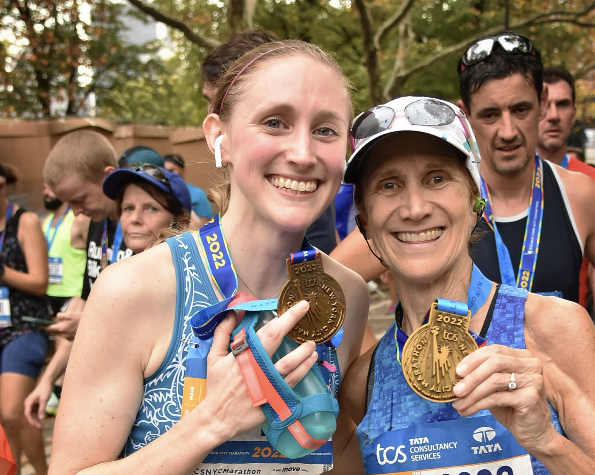

   

## Introduction

On November 6th, 2022, Emma Sexton ran her first marathon. One month later, we analyzed the data to assess factors that impacted her training and race day performance. 

  

## Screencast

  

## Motivation

Running a marathon requires an immense amount of time, effort, and dedication. First-time marathon runners are forced to make decisions with little knowledge of what to expect. Being ill-prepared and over-training are two common experiences that occur during training and on race day. Emma, one of our group members, ran the New York City Marathon (NYCM) this past fall, which was her first marathon. After completing the marathon on November 6th, Emma was prepared to start training for the next one. Therefore, we are interested in understanding the impact of external factors, such as temperature, wind, elevation, etc., on Emma's speed and performance during the marathon, while also considering how training changed over time in order to improve her training for the next marathon.

{width=50%}  

Emma and her mom after finishing the 2022 New York City Marathon

  

## Group Members

* Gwyneth Wei (gw2442)
* Emma Sexton (els2250)
* Olivia Wang (hw2852)
* Mayuri Albal (ma4197)

